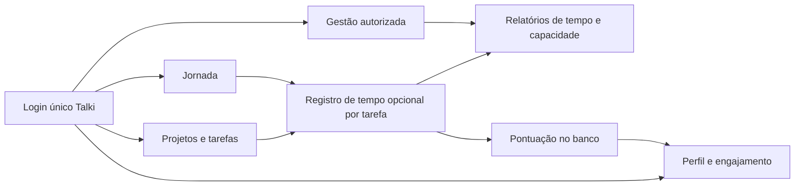

# Plano de migração completa — Pareto dentro do Talki

Data: 16/09/2026. Proposta executável em etapas, baseada no [diagnóstico](raio-x-talki-pareto.md). Este plano não autoriza por si só alterações em produção e não contém credenciais.

**Implementação publicada após autorização do usuário:** módulo Jornada integrado e snapshot importado. O corte do Pareto permanece pendente de confirmação específica após bloqueio da revisão automática. Detalhes, testes e pendências no [registro de execução](migracao-andamento.md).

## 1. Resultado esperado

Um único Talki, com login, navegação, projetos e tarefas compartilhados. O Pareto entra como módulo de **Jornada**, com apontamento de tempo, relatórios, ficha do colaborador e gamificação. O banco configurado no Talki (`iqgrvptrtphvbmvrqntm`) é o destino confirmado pelo usuário em 16/09/2026; conferir a configuração do deployment antes de executar.

Manter React/Vite do Talki. Adaptar componentes e regras do Pareto; substituir partes Next.js por consultas/RPC protegidas e Edge Functions. A alternativa de converter todo o Talki para Next.js acrescentaria uma reescrita sem necessidade funcional identificada. Um iframe não atenderia à unificação de identidade e dados.

## 2. Escopo funcional completo

| Pareto atual | Destino proposto | Critério de paridade |
|---|---|---|
| Registro | `/jornada` | Criar, encerrar, trocar, editar, pausas, fim do expediente, histórico diário e cronômetro |
| Perfil | `/perfil` | Editar dados permitidos, consultar ficha, saldo, histórico, níveis/dragão |
| Dashboard | `/gestao` | Horas, adesão, aderência, carga, pessoas e sinais, com definições consistentes |
| Relatórios | `/relatorios` | Seis relatórios existentes, filtros e CSV; incluir tarefa como dimensão nova |
| Usuários | `/gestao/pessoas` | Provisionamento/reutilização de identidade, permissões e desativação do módulo |
| Áreas | `/gestao/areas` | Nome, estado ativo e relacionamento com pessoas/projetos |
| Categorias | `/gestao/categorias` | Nome, cor, manutenção sem apagar referências históricas |
| Projetos | `/tarefas` | Cadastro único baseado em `plans`, com metadados de área/ativo |
| Login e landing | Entrada do Talki e redirecionamentos do domínio antigo | Sessão única após novo login; links antigos têm destino definido |

Na tarefa: “Iniciar atividade”, tempo pessoal e acesso ao histórico autorizado. Na navegação global: cronômetro que permanece ao mudar de página. Atividades sem tarefa e sem projeto continuam válidas; reuniões e pausas não precisam virar cards.

Não tratar uma pausa como tarefa concluída. Não duplicar apontamentos para cada responsável de uma tarefa. `participantes` continua texto legado; futura lista de pessoas não deve inventar associações retroativas.

Comunicados completos, chat/Mattermost, folha de pagamento e reformulação de outros produtos ficam fora desta migração.

## 3. Modelo de dados proposto

Usar tabelas novas com prefixo `talki_` no schema público, com RLS e grants explícitos. Evitar nomes genéricos e substituição de helpers compartilhados. É uma decisão de implementação proposta, não schema já criado.

| Origem | Destino | Transformação |
|---|---|---|
| Auth + `profiles.id` Pareto | Auth existente + `profiles.id` Talki | Mapa explícito de identidade; UUID da origem não é presumido igual |
| `profiles.nome/email/cargo` | `profiles` Talki | Preservar valores existentes; preencher ausências após conciliação; conflitos ficam em relatório |
| Ficha Pareto | `talki_colaboradores` | `user_id`, sobrenome, nascimento, descrição do cargo, área, horas contratadas e ativo; acesso privado |
| `profiles.role` Pareto | `talki_module_members` | Acesso de participante/gestor de Jornada; não promover automaticamente a admin global |
| `profiles.moedas` | `talki_saldos` | Saldo inicial autoritativo preservado; escrita apenas por rotina controlada |
| `areas` | `talki_areas` | Preservar campos e IDs se não houver colisão, caso contrário mapear |
| `categorias_atividade` | `talki_categorias_atividade` | Preservar nomes/cores; adicionar chave semântica estável para agregações |
| `projetos` | `plans` + `talki_plan_settings` | Associar a projeto existente somente por mapa revisado; criar novo quando necessário |
| `registros` | `talki_registros` | Remapear usuário, área, categoria e projeto; `task_id` inicia NULL no histórico |
| `pontuacao_diaria` | `talki_pontuacao_diaria` | Preservar valores históricos e unicidade por usuário/data |
| Funções/triggers Pareto | Funções específicas Talki | Reescrever referências, autorização, idempotência e proteção de campos |

`talki_plan_settings(plan_id, area_id, ativo)` evita alterar o shape de `plans` sem necessidade. Projeto Pareto não tem criador: todo novo plano importado precisa de dono explicitamente definido, membro inicial e bucket inicial. Importação não deduz membros a partir da área; acesso a projetos precisa ser listado.

`talki_registros` conserva descrição, participantes, `entrega_concluida`, `inicio`, `fim`, `created_at`, `updated_at` e proveniência. Acrescenta `plan_id`, `task_id` opcionais e snapshots mínimos de nome de projeto/tarefa para histórico. `area_id` do apontamento continua distinto da área de lotação da pessoa.

Guardar mapas em schema privado de migração: execução, versão, tabela de origem, ID de origem, ID de destino, hash do conteúdo e estado da importação. Unicidade `(origem, tabela, id_origem)` permite reexecução e rastreamento sem duplicar dados. Arquivos temporários e exportações ficam fora do Git, com acesso restrito.

### Integridade e conservação de histórico

- Um registro aberto por usuário, por índice único parcial. Validar `fim >= inicio`, permitindo o marcador zero “Fim do expediente”.
- Consulta de registro aberto independe da data; cronômetro deriva de timestamps persistidos.
- `task_id` só pode apontar para tarefa acessível no momento da associação e compatível com o projeto escolhido; validar no servidor/banco, não apenas na tela.
- Definir `plan_id` do apontamento como projeto histórico no momento do trabalho. Mover tarefa para outro plano não reclassifica horas anteriores; novos registros usam o plano atual. Snapshots evitam depender do título atual.
- Remoção de vínculo/permissão não concede acesso ao novo projeto por meio do histórico. O titular pode consultar seu registro e snapshot sem ler metadados atuais restritos da tarefa.
- Arquivar projetos com histórico. Para exclusão física de tarefa, preservar registro e snapshot com `task_id` anulável; não apagar tempo em cascata. Duplicar tarefa não duplica horas.
- Não eliminar registros do usuário ao desativar acesso. Exclusão de Auth global requer procedimento separado, por ser compartilhado com outros produtos.
- Índices por `(user_id,inicio)`, `(plan_id,inicio)`, `(task_id,inicio)` e data da pontuação, dimensionados pelas consultas. Exportações devem paginar e respeitar RLS.

## 4. Autenticação, pessoas e permissões

1. Inventariar somente as identidades relacionadas aos dez perfis Pareto; conferir `auth.users`, e-mails verificados, provedores, duplicatas e fichas ausentes nos dois projetos.
2. Revisar seis candidatos de e-mail coincidente. Reutilizar o UUID Talki quando confirmada a mesma pessoa, preservando sua senha, papéis e termos já aceitos.
3. Para os quatro perfis sem coincidência, procurar primeiro contas Auth sem ficha. Criar conta apenas se não existir identidade compatível.
4. Para novas contas, caminho recomendado: provisionamento seguro e ativação/reset de senha no Talki. Implementar esse fluxo antes do corte. Não migrar sessões, cookies ou tokens Pareto; não prometer preservação de senhas.
5. Se preservar senhas antigas se tornar requisito, abrir trilha específica de migração Auth seletiva em homologação. Não restaurar `auth` inteiro no projeto compartilhado.
6. Conciliar campos com regra por coluna e relatório de conflito. Nunca rebaixar admin Talki por importar colaborador; admin Pareto vira gestor do módulo, salvo decisão expressa diferente.

| Capacidade | Participante Jornada | Dono/membro de projeto | Gestor Jornada | Admin Talki |
|---|---|---|---|---|
| Ver/editar próprios apontamentos | Sim, conforme política de período | Só se também participante | Próprios; correções de terceiros por fluxo auditado | Conforme autorização explícita |
| Ver dados pessoais privados de terceiros | Não | Não | Campos necessários à gestão | Via função administrativa autorizada |
| Consultar indicadores da equipe | Não | Sem acesso automático a horas individuais | Sim | Sim, conforme configuração |
| Acessar tarefas | Conforme membros de cada plano | Permissão existente | Não ganha todos os projetos por ser gestor | Regra atual de admin |
| Configurar horas contratadas/área/ativo | Não | Não | Sim | Sim |
| Alterar saldo/papel global diretamente | Não | Não | Não | Somente operação administrativa controlada |

RLS verifica `auth.uid()`, participação ativa no módulo e escopo. Gestor de jornada não deve usar chave privilegiada no navegador. APIs administrativas validam identidade e permissão atual, aceitam apenas campos permitidos e registram auditoria. Evitar confiar em `user_metadata` para autorização.

Corrigir a proteção de `profiles.role` existente antes de liberar o módulo. Testar também INSERT do próprio perfil com `role=admin`, autoexclusão/recriação e mudanças de horas/saldo via REST. Testes negativos rodam em homologação com usuários sintéticos.

## 5. Contrato de tempo, relatórios e gamificação

### Tempo e indicadores

Persistir instantes em `timestamptz`; adotar `America/Sao_Paulo` para dia de negócio. Painel e relatórios devem usar o mesmo serviço de cálculo. Manter datas de tarefas como `date`.

Recomendação: contabilizar horas fechadas para relatórios oficiais, duração ao vivo apenas como provisória. Dividir duração por interseção com o dia/período para novos relatórios; conservar dados brutos e registrar diferenças frente ao Pareto, que atribui toda a duração ao dia de início. Nada é corrigido silenciosamente na importação.

Capacidade: dias úteis reais seg–sex e jornada contratada vigente. Registrar vigência de mudanças de jornada e área a partir da unificação; não inventar histórico ausente. Durante a conciliação, reproduzir também o cálculo legado para explicar diferenças. Separar “área da pessoa” e “área da atividade” nos filtros.

Benchmark mantém agrupamento por categoria + descrição normalizada, ao menos duas ocorrências e duração mínima de um minuto. “80/20” continua concentração de horas. Não interpretar registro como produtividade automaticamente.

### Pontuação

Preservar as quatro linhas e saldos existentes **sem reprocessamento retroativo**. Saldo não equivale necessariamente à soma simples dos deltas, pois há piso zero e possível histórico anterior.

Regra proposta para continuidade: usar a regra SQL hoje autoritativa, corrigindo concorrência/ordem e ajustando a interface. Faixas: 100% → +5; 90% → +3; 80% → +2; 70% → +1; 60% → −1; 50% → −2; abaixo → −5. Meta considerada batida em 70%. A regra de 10 moedas + sequência do frontend não será misturada com essa.

Essa escolha precisa ser validada como decisão de produto. Alteração posterior entra com versão e data de vigência. A função atual avalia dias anteriores que têm registros; não penaliza automaticamente dias sem registros. Preservar esse comportamento na primeira versão, a menos que seja expressamente alterado.

Rotina nova processa dias em ordem cronológica, serializa por usuário, insere ledger e aplica saldo somente quando a linha foi inserida. Saldo e ledger são atualizados na mesma transação. `ON CONFLICT DO NOTHING` isolado não garante isso. Reprocessamento de dia corrigido exige ajuste auditado, não crédito repetido.

Preservar apresentação de saldo, níveis, dragão e asas; remover promessas locais de ganhos incompatíveis. Dragão: 0 ovo, 1–9 bebê, 10–24 filhote, 25–49 jovem, 50+ adulto. Asas: ao menos 20 metas batidas nos últimos 30 dias avaliados, com 30 avaliações disponíveis.

## 6. Fases e entregas

| Fase | Trabalho | Saída verificável / dependência |
|---|---|---|
| 0 — Ambiente e segurança | Conferir deploy do destino confirmado, rotacionar segredos expostos, corrigir elevação de papel e identificar dependências compartilhadas | Ambientes definidos; testes negativos de privilégio aprovados |
| 1 — Baseline e conciliação | Exportar DDL selecionado real, funções, triggers, grants; mapear pessoas/projetos; capturar números legados | Baseline reproduzível + mapas sem ambiguidades + backup restaurado em ambiente isolado |
| 2 — Núcleo de dados | Criar tabelas, RLS, índices, RPCs transacionais, ficha privada e acesso ao módulo | Schema construído do zero em homologação e contratos testados |
| 3 — Jornada integrada | Rotas, cronômetro global, registros/edição/atalhos, ligação tarefa/projeto, recuperação de perfil e senha | Fluxos completos em desktop/mobile e concorrência entre abas |
| 4 — Gestão e engajamento | Cadastros, relatórios, CSV, métricas, saldo/ledger, níveis/dragão | Paridade funcional e divergências numéricas explicadas |
| 5 — Ensaio integral | Importar cópia selecionada, reconciliar dados, repetir importação, ensaiar corte e retorno | Segunda importação cria zero duplicatas; teste de rollback sem perda |
| 6 — Piloto e corte | Publicar módulo controlado, habilitar grupo piloto, congelar origem no corte, importar estado final e redirecionar | Um único escritor de jornada por usuário; todos os critérios de aceite atendidos |
| 7 — Encerramento | Observação, suporte, confirmação de cobertura, retirar frontend Pareto da operação | Histórico preservado, URLs redirecionadas, credenciais temporárias revogadas; banco compartilhado mantido |

Estimativa de planejamento: **4–6 semanas para uma pessoa dedicada**, incluindo homologação e piloto; recalibrar após fase 1. Volume atual é pequeno; os principais custos são identidade, regras de negócio, autorização e compatibilidade. Não é compromisso de prazo nem pressupõe executar agentes paralelos.

### Sequência sugerida de PRs

1. Proteção de perfis, testes de autorização e documentação do ambiente.
2. Baseline selecionado, tabelas/RLS do módulo e tipos limitados ao domínio Talki.
3. RPCs de registros e importador com modo de simulação e mapa de identidades.
4. Jornada/cronômetro e integração com detalhes da tarefa.
5. Pessoas, áreas, categorias, perfil e recuperação de conta.
6. Relatórios/CSV e unificação de métricas.
7. Pontuação autoritativa, histórico e componentes de engajamento.
8. Scripts de conciliação, corte, retorno e redirecionamentos.

Cada PR deve deixar a aplicação utilizável. Flags de UI controlam exposição, mas acesso também precisa ser bloqueado no backend quando o módulo estiver desabilitado. Não criar dependência duradoura de dois Supabase no frontend unificado.

## 7. Importação e execução do corte

### Preparação

- Capturar versões de código, catálogo, permissões, dependências e contagens em um manifesto datado.
- Lista permitida da origem: seis tabelas do Pareto, identidades associadas e funções/triggers necessários. `profiles` deve ser transformada, nunca substituída no destino.
- Não migrar buckets de RH/recrutamento. O código Pareto não mostrou upload de arquivos; confirmar referências antes de declarar Storage fora do escopo. Se necessário, copiar apenas objetos vinculados e verificar conteúdo/permissões.
- Provisionar identidades, áreas, categorias, planos/metadados, vínculos de módulo, fichas, registros, pontuação e saldos nessa ordem de dependências. IDs remapeados ficam no manifesto privado.
- Importador usa UPSERT controlado por proveniência, valida colisões, rejeita órfãos e não sobrescreve dados já editados no destino. Saldos são inicializados uma vez, jamais somados de novo numa repetição.
- Separar simulação e aplicação; simulação produz diff e rejeições, sem escritas. Paginar todas as leituras, mesmo com 22 registros atuais.
- Não disparar e-mails nem reavaliar pontuação durante importação. Controlar exclusivamente os mecanismos do Talki envolvidos; não desativar triggers globalmente no banco compartilhado.

### Piloto

Usar homologação para ensaio geral. Para piloto com dados reais, definir usuários migrados e data de transferência de escrita: cada usuário registra tempo em apenas um sistema. Origem fica sem escrita de Jornada para esses usuários por controles de banco/API, não só removendo botões. Comparação pode ser de leitura; evitar escrita dupla e sincronização bidirecional.

### Janela final

1. Conferir aceite, mapas e backup restaurável; registrar horário T0.
2. Bloquear escrita e RPCs de pontuação **do módulo Pareto** na origem; preservar outros sistemas. Confirmar o bloqueio com conta normal e verificar ausência de escritores de servidor.
3. Listar blocos abertos. Preservá-los para retomada no destino; encerramento artificial só com decisão registrada. Resolver conflitos de um bloco aberto por pessoa.
4. Com origem congelada, exportar novamente o conjunto completo permitido, pois o volume é pequeno. Comparar IDs para detectar inclusive exclusões desde o ensaio; somente `updated_at` não captura DELETE nem mudanças em tabelas sem timestamp.
5. Aplicar transações por etapa dependente; reconciliar contagens, IDs, conteúdo, FKs, segundos, perfis, saldos e histórico. Rejeição não resolvida impede avanço.
6. Habilitar escrita no Talki, validar login e fluxos com usuários autorizados, registrar T1 e redirecionar rotas antigas. Manter fonte congelada como referência.
7. Monitorar erros de Auth/RLS/PostgREST, falhas de registro e pontuação, métricas e alertas Talki. Janela inicial de observação proposta: 7–14 dias, incluindo mais de um fechamento diário.

Migrations por si sós não configuram frontend, redirecionamentos, secrets ou armazenamento. Documentar cada dependência e conferir sua restauração separadamente conforme a [documentação oficial de migração Supabase](https://supabase.com/docs/guides/platform/migrating-within-supabase/backup-restore).

## 8. Aceite e validação

| Dimensão | Condição para liberar |
|---|---|
| Identidade | 100% dos perfis Pareto com destino definido; zero contas duplicadas inadvertidas; acesso mínimo preservado |
| Dados | Contagens por entidade e por pessoa conciliadas; zero FKs órfãs; comparação de conteúdo com transformações documentadas |
| Duração | Soma de segundos fechados idêntica na importação; números por período conciliados segundo regra legada e nova |
| Pontuação | Saldos/histórico preservados; duas chamadas simultâneas não duplicam crédito; correção posterior auditada |
| RLS | Anônimo, usuário fora do módulo e usuário de outro projeto não obtêm acesso indevido via REST/RPC |
| Campos | Usuário não altera role, ativo, jornada contratada, saldo ou titular de registro por requisição direta |
| Jornada | Duas abas, falha ao trocar atividade, refresh, virada de dia, bloco de ontem, atividade sem tarefa e marcador zero cobertos |
| Projetos | Mover/excluir/duplicar tarefa e remover membro preservam histórico sem vazamento de dados |
| Relatórios | Seis relatórios e CSV presentes; períodos, área da pessoa/atividade, zeros e paginação consistentes |
| Regressão Talki | Quadro, DnD, checklist, convites, responsáveis, filtros, comentários, agenda e notificações funcionam |
| Operação | Restore ensaiado, importação repetível, retorno ensaiado e um único escritor por usuário |

Usar testes unitários para métricas/fuso, integração Postgres para transações e RLS e E2E para fluxos essenciais. Validar embeds PostgREST contra schema de homologação com hints explícitos de FK. Lint/build continuam obrigatórios, mas não substituem essas verificações.

## 9. Retorno em caso de falha

Antes de T1: manter Pareto como origem, desabilitar módulo novo e remover/reverter somente objetos da execução de importação se necessário. Não apagar contas compartilhadas nem restaurar o banco inteiro.

Depois de T1: esconder tela não desfaz dados novos. Bloquear temporariamente escrita de Jornada no Talki, capturar criações/edições/exclusões e saldos desde T1, aplicar tradução inversa dos mapas e reconciliar antes de reabrir a origem. Associação com tarefas pode ser preservada no ledger de migração se a origem não suportar o campo.

Se a tradução inversa não estiver validada, manter ambos os escritores bloqueados e corrigir adiante; não reabrir a origem desatualizada e perder trabalho. Guardar logs de mudança/tombstones desde T1 para permitir retorno real. Ensaiar esse procedimento na fase 5.

Gatilhos de retorno: falha de acesso relevante, divergência não explicada de dados/saldo, vazamento de autorização ou erro persistente ao registrar atividades. Decisão operacional deve identificar responsável e última conciliação válida. Objetivo: nenhuma perda de registros confirmados; tempo de recuperação deve ser medido no ensaio, não presumido.

## 10. Decisões pendentes antes de executar

1. **Destino confirmado em 16/09/2026:** `iqgrvptrtphvbmvrqntm`. Resta conferir a configuração de produção; não é necessário pedir novamente a identificação do banco.
2. Revisar mapa de dez pessoas e do projeto Pareto: dono, membros e correspondência com os 20 planos Talki.
3. Validar a regra autoritativa de pontuação e a correção de métricas/fuso com diferenças históricas explicitadas.
4. Confirmar quais pessoas podem ver horas individuais e quais serão gestoras apenas da Jornada.
5. Definir responsável pelo corte, janela operacional, política de edição retroativa e retenção do legado.

Essas decisões não impedem o planejamento; impedem escolhas irreversíveis de dados/permissões na execução. Recomendação de primeiro passo: fase 0 e baseline da fase 1, antes de adaptar telas.

Referência de autorização: [RLS no Supabase](https://supabase.com/docs/guides/database/postgres/row-level-security). Habilitar RLS, definir políticas e grants são partes complementares; proteger somente a interface não restringe a API.
